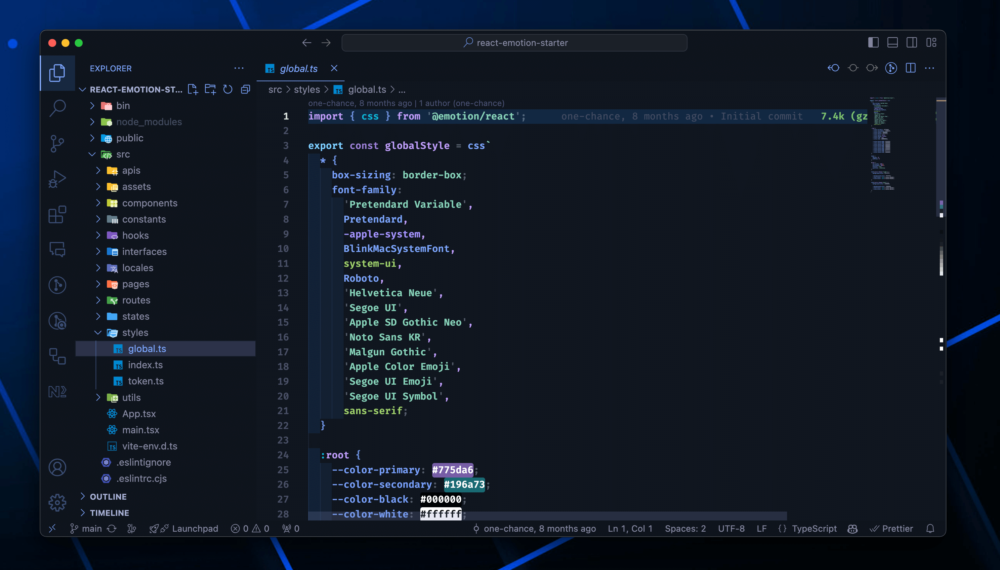
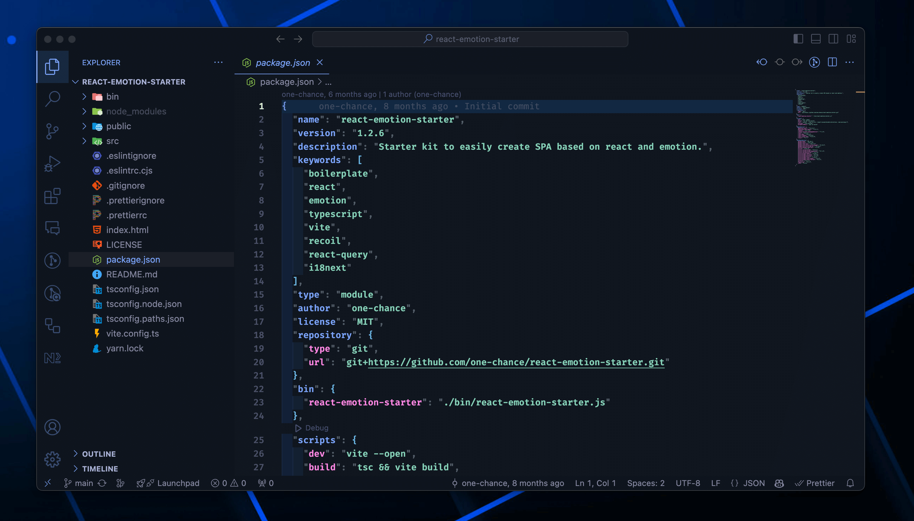
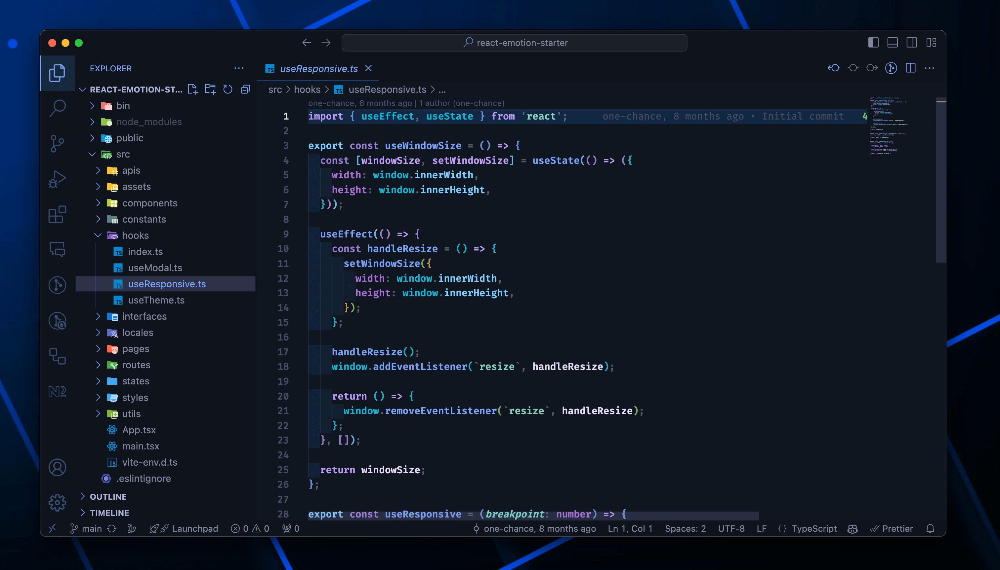

<div align="center">
<h1>
<br/>
ᴛᴏᴋʏᴏ ɴɪɢʜᴛ ᴅʀɪᴠᴇ ᴛʜᴇᴍᴇ</h1>
A mix of of the beauty from <a href="https://marketplace.visualstudio.com/items?itemName=enkia.tokyo-night">Tokyo Night</a> theme and the candy colors from <a href="https://marketplace.visualstudio.com/items?itemName=KacperBiedka.one-candy-dark">One Candy Dark</a>. <br/>
Features a slightly darker background and vibrant highlight colors.<br/>
<br/>
<br/>
</div>

## &nbsp; Screenshots






## &nbsp; Installation

1. Open the `Command Palette` with `Ctrl + Shift + P` / `Command + Shift + P`
2. Type `Tokyo Night Drive`
3. Press Enter
4. Enjoy it!

## &nbsp; Settings

Here are a few settings I use:

```json
"editor.fontFamily": "'FiraCode Nerd Font', Consolas, 'Courier New', monospace",
"editor.fontSize": 13,
"editor.fontWeight": "600",
"editor.lineHeight": 1.5,
"material-icon-theme.folders.color": "#42a5f5",
"material-icon-theme.files.color": "#42a5f5",
"indentRainbow.colors": [
  "rgba(20, 120, 280, 0.1)",
  "rgba(20, 160, 280, 0.08)",
  "rgba(20, 160, 280, 0.08)",
  "rgba(20, 160, 280, 0.06)",
  "rgba(20, 160, 280, 0.04)",
  "rgba(20, 180, 200, 0.04)",
  "rgba(20, 180, 200, 0.06)",
  "rgba(20, 180, 200, 0.08)",
  "rgba(20, 190, 190, 0.08)",
  "rgba(20, 190, 190, 0.1)"
],
```
